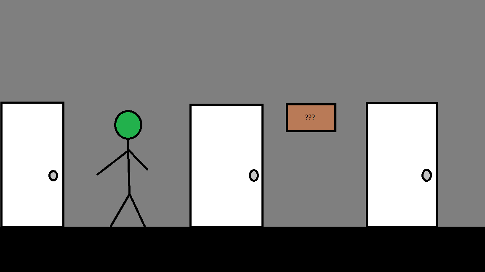

# Hospital Mystery

Author: Woody McCoy

Design: A walking simulator about exploring an abandoned hospital for clues about your life. This game was not actually made due to midterm season.

Screen Shot:

How To Play:

Move around with all 4 arrow keys. Enter to open a door, or inspect a nearby item. Find all the clues to end the game.

Sources: N/A

This game was built with [NEST](NEST.md).

